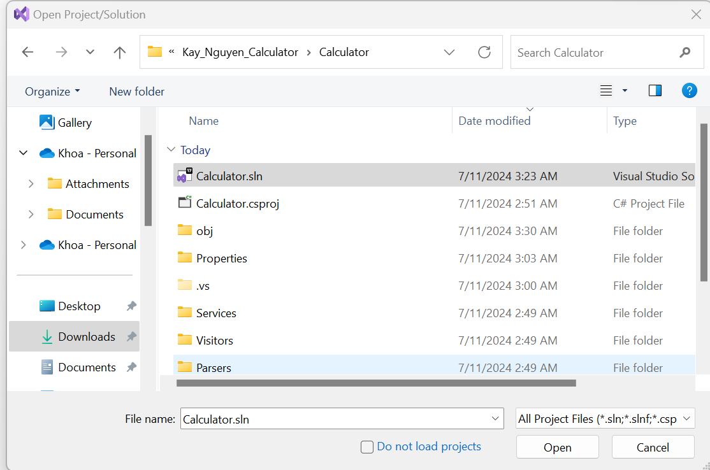
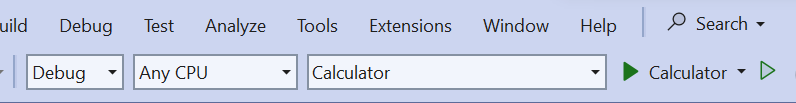
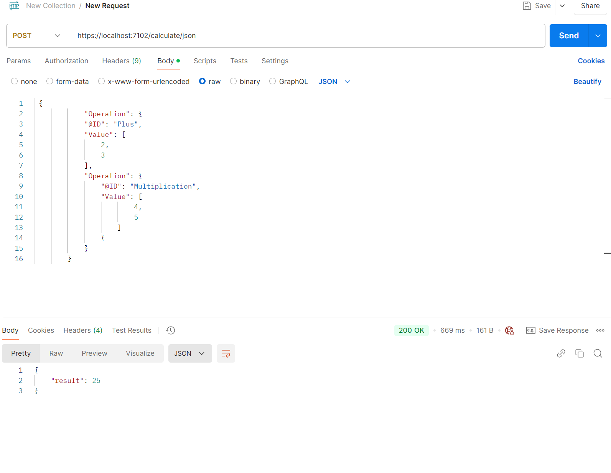
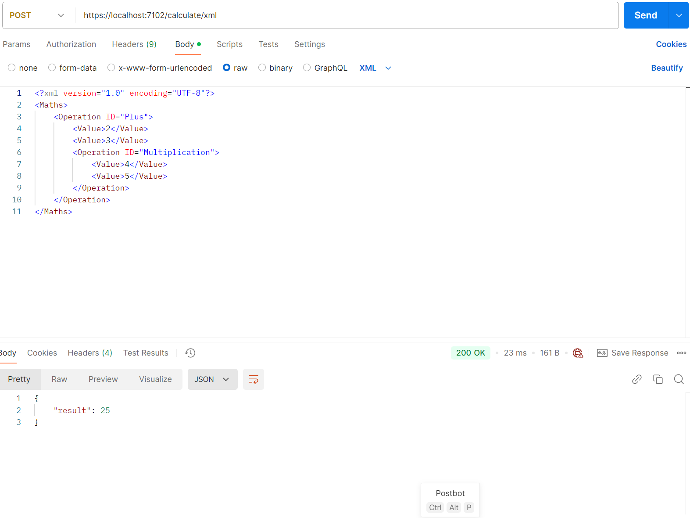
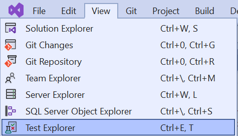
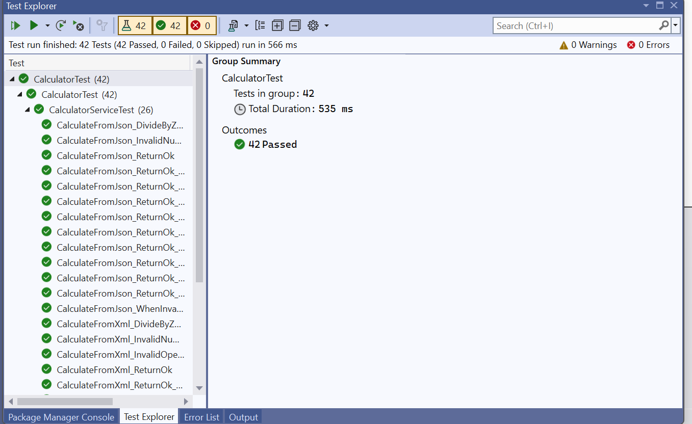

# Kay_Nguyen_Calculator
# Kay Nguyen 
## Approach
- For this exercise, I implemented the requested basic RESTful web service for a calculator supporting four primary operations (+, -, *, /) using `.NET` with `C#` language. I designed the service to take two numerical arguments and return the result of the specified operation. Additionally, I anticipated scenarios where nested operations might be beneficial for users needing more complex calculations. To accommodate this, I developed advanced function that allows the service to handle nested operations, giving it a more versatile and extensible functionality. This approach ensures that the calculator is both simple for basic calculations and robust enough to manage more advanced operations if required in the future.

- The API is able to handle `JSON` and `XML` format.

## How To Run the Project API 

- Step 1: Open __Visual Studio__
- Step 2: Click __Open Project/Solution__
- Step 3: Click on the `Calculator.sln` folder 

    

- Step 4: Click __Visual Studio Run Button__ to start the API

    

- Step 5: Open __[Postman](https://www.postman.com/)__ and test the API

### Example API To Test: 

#### 1. JSON Format
- Identify the `Port Number` the Project is running on.
- Create a `POST` HTTP Request with `JSON`:
- Replace `{POST_METHOD}` with the `Port Number` 

    1. __URL__: `https://localhost:{PORT_NUMBER}/calculate/json`
    2. __Body__: 
    ```json
    {
        {
            "Operation": {
            "@ID": "Plus",
            "Value": [
                2,
                3
            ],
            "Operation": {
                "@ID": "Multiplication",
                "Value": [
                        4,
                        5
                    ]   
                }
            }
        }
    }
    ```
    

#### 2. XML Format

- Identify the `Port Number` the Project is running on.
- Create a `POST` HTTP Request with `XML`:
- Replace `{POST_METHOD}` with the `Port Number` 

    1. __URL__: `https://localhost:{PORT_NUMBER}/calculate/xml`
    2. __Body__: 
    ```xml
    <?xml version="1.0" encoding="UTF-8"?>
    <Maths>
        <Operation ID="Plus">
            <Value>2</Value>
            <Value>3</Value>
            <Operation ID="Multiplication">
                <Value>4</Value>
                <Value>5</Value>
            </Operation>
        </Operation>
    </Maths>
    ```

    

# How to Run Test

- Step 1: Open __Visual Studio__
- Step 2: Click __Open Project/Solution__
- Step 3: Click on the `Calculator.sln` folder 
- Step 4: Under __View__ Click __Test Explorer__ as below 
            
- Step 5: Under __Test Explorer__ Click __Run__ Button 
    


## Design Pattern 
- For maintainability, scalability and reusability, design patterns 

    1. __Template Design Pattern__ 
    2.  __Visitor Design Pattern__ 

were chosen to support the implementation of the project.

### 1. Template Design Pattern

- `ExpressionParser.cs` is an Abstract Class that support the parse process of the input format. 

- `JsonExpressionParser.cs` and `XmlExpressionParser.cs` are the concrete class that inherit from `ExpressionParser.cs` to support the parsing of `JSON` and `XML` format.

### 2. Visitor Design Pattern
- `AST` Method is used to parse the input format and calculate the result.

- As such, we will have 2 type of value to calculate 

     1. `BinaryExpreesion.cs`: Present the binary expression (Left and Right) of the tree
     2. `NumberExpression.cs` : Present the number value of the tree

#### Interface
__A. `IExpression.cs`__ 
- This interface that support the accept method to calculate the result of the binary and number expression.

- `BinaryExpreesion.cs` and `NumberExpression.cs` are the concrete class that inherit from `IExpression.cs` to support the calculation of the binary expression and number value.

- Because we will do calculation on the binary and number expression, we will have a `IExpression` interface to do the calculation.

```
double Accept(IVisitor visitor);
```

__B. `IVisitor.cs`__

- This interface use to calculate the binary expression and number value based on given object. 

- `ExpressionVisitor.cs` is the concrete class the inherit from `IVisitor.cs` to support the calculation of the binary expression and number value.

- `ExpressionVisitor.cs` has 2 method and is the class that will do the calculation of the binary expression and number value.

```
double Visit(NumberExpression number);
double Visit(BinaryExpression operation);
```
